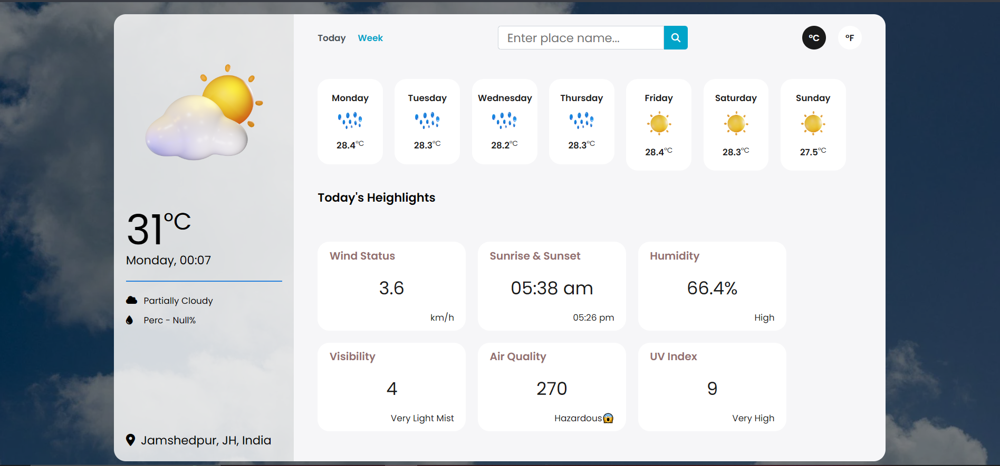

# Weather Application

A simple weather application that provides the current weather conditions for any city using HTML, CSS, JavaScript, and a weather API.

## Features

- Search weather by city name
- Displays current temperature, weather condition, humidity, and wind speed
- Uses a weather API to fetch real-time data

## Screenshots

Include screenshots of the application (if available).


### Prerequisites

- Basic knowledge of HTML, CSS, and JavaScript
- A weather API key (e.g., OpenWeather API)

### Installation

1. Clone the repository:

    ```bash
    git clone https://github.com/your-username/weather-app.git
    ```

2. Navigate to the project directory:

    ```bash
    cd weather-app
    ```

3. Open the `index.html` file in your browser to view the application.

### Using a Weather API

You will need an API key from a weather service such as [OpenWeather](https://openweathermap.org/api). Follow these steps:

1. Sign up and get your API key from the OpenWeather website.
2. Replace the placeholder API key in the JavaScript file with your own key.

    ```js
    const apiKey = 'YOUR_API_KEY_HERE';
    ```

## File Structure

weather-app/  
        │ └── style.css # Contains the app's styling 
        │ └── script.js # Contains the app's logic and API interaction 
        │ ├── Weather_App.html # Main HTML file 
        | └── README.md 

## Technologies Used

1. HTML
2. CSS
3. JavaScript
4. OpenWeather API (or any other weather API)


## Contributing

Feel free to submit a pull request if you want to contribute to this project.